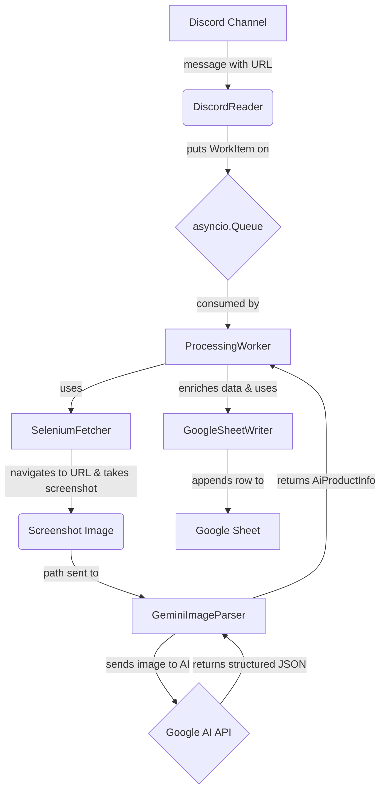

# DiscProdSheetify

A Discord bot that automatically scrapes product information from URLs posted in a channel, uses AI vision to extract structured data from screenshots, and populates a Google Sheet in real-time.

## The Pipeline

The bot is built on a modular, asynchronous architecture. When a URL is posted in Discord, it triggers the following pipeline:



## Features

- **Automated URL Detection**: Monitors Discord channels for any valid URLs.
- **Robust Web Scraping**: Uses a stealth-configured Selenium to render JavaScript-heavy pages and take screenshots, bypassing many anti-bot measures.
- **Intelligent Data Extraction**: Leverages a multimodal AI model (Google's Gemini) to parse screenshots and extract key product details, including CAPTCHA detection and a headed-mode fallback.
- **Structured Data Output**: Enriches AI data with user context and writes it to a Google Sheet in a clean, organized format.
- **Concurrent Processing**: Built on `asyncio` to handle multiple requests simultaneously without blocking.
- **Production-Ready**: Runs as a resilient `systemd` service on Linux for auto-restarts and reliable background operation.
- **CI/CD Enabled**: Features a GitHub Actions workflow for automated, hands-off deployments to a self-hosted runner.

## Tech Stack

- **Bot Framework**: `discord.py`
- **Web Automation**: `Selenium`
- **AI / Data Extraction**: `google-generativeai` (Gemini Pro Vision)
- **Data Validation**: `Pydantic`
- **Spreadsheet Integration**: `google-api-python-client`
- **Concurrency**: `asyncio`
- **Dependency Management**: `uv`
- **CI/CD**: `GitHub Actions` (with a self-hosted runner)
- **Deployment**: `systemd` on Linux

## Getting Started

Follow these instructions to set up and run your own instance of `DiscProdSheetify`.

### Prerequisites

- Python 3.11+
- `uv` - A fast Python package installer and resolver.
- Google Chrome installed on the host machine (for Selenium).
- A Discord Bot Token, a Google AI Studio API Key, and Google Sheets API credentials.

### 1. Clone the Repository

```bash
git clone https://github.com/your-username/DiscProdSheetify.git
cd DiscProdSheetify
```

### 2. Set Up Configuration

The project uses a `.env` file to manage secrets and configuration.

1.  **Create the `.env` file**: Copy the example template to create your own local configuration file. This file is listed in `.gitignore` and should never be committed.
    ```bash
    cp config/.env.example config/.env
    ```

2.  **Edit `config/.env`**: Open the file and fill in the values for your environment.
    ```ini
    # config/.env
    AI_STUDIO_API_KEY="your_google_ai_studio_key"
    DISCORD_BOT_TOKEN="your_discord_bot_token"
    GOOGLE_SHEETS_CREDENTIALS_JSON_PATH="/path/to/your/project/config/google-sheets-api-key.json"
    GOOGLE_SHEET_ID="your_google_sheet_id"
    GOOGLE_SHEET_NAME="SheetName"
    ```

3.  **Add Google Sheets Credentials**: Place your `google-sheets-api-key.json` file (obtained from the Google Cloud Console) inside the `config/` directory.

### 3. Install Dependencies

Set up the virtual environment and install all required packages using `uv`.

```bash
uv venv  # Creates a .venv folder
uv sync  # Installs packages from pyproject.toml/uv.lock
```

## Running the Bot

### For Development

To run the bot directly from your terminal for testing and development:

```bash
uv run python main.py
```

### For Production

For a reliable, long-running deployment, the bot is designed to run as a `systemd` service on a Linux server.

1.  **Create the Service File**:
    ```bash
    sudo nano /etc/systemd/system/DiscProdSheetify.service
    ```

2.  **Paste and Edit the Configuration**: Use the template below, making sure to replace `your_vm_user` and verify all paths are correct.
    ```ini
    [Unit]
    Description=Discord Product Scraper Bot (DiscProdSheetify)
    After=network-online.target

    [Service]
    User=your_vm_user
    Group=your_vm_user
    WorkingDirectory=/home/your_vm_user/DiscProdSheetify
    EnvironmentFile=/home/your_vm_user/DiscProdSheetify/config/.env
    
    # Use xvfb-run to provide a virtual display for headless Selenium
    ExecStart=xvfb-run -a /home/your_vm_user/.local/bin/uv run python main.py
    
    Restart=on-failure
    RestartSec=5

    [Install]
    WantedBy=multi-user.target
    ```

3.  **Enable and Start the Service**:
    ```bash
    sudo systemctl daemon-reload
    sudo systemctl enable DiscProdSheetify.service
    sudo systemctl start DiscProdSheetify.service
    ```

4.  **Check Status and Logs**:
    ```bash
    sudo systemctl status DiscProdSheetify.service
    sudo journalctl -u DiscProdSheetify.service -f
    ```

## Automated Deployment (CI/CD)

This project is configured for automated deployments using GitHub Actions. Due to the bot running on a private network, it uses a **self-hosted runner**.

The workflow is defined in `.github/workflows/deploy.yml` and performs the following steps on every push to `main`:
1.  Pulls the latest code using `git pull --hard-reset`.
2.  Syncs Python dependencies with `uv sync`.
3.  Restarts the `systemd` service gracefully.

To enable this, you must set up a self-hosted runner on your server and add the required repository secrets (`SSH_HOST`, `SSH_USER`, `SSH_PRIVATE_KEY`).

## Project Structure

```
product_scraper_bot/
├── .github/          # GitHub Actions CI/CD workflows
├── config/
│   ├── .env          # Stores secrets and configuration
│   └── .env.example  # Template for the .env file
├── src/
│   ├── data_models.py      # Pydantic models for data validation
│   ├── discord_reader.py   # Discord bot client and message handling
│   ├── fetchers.py         # Selenium logic for fetching web content
│   ├── interfaces.py       # Abstract base classes for components
│   ├── parsers.py          # AI logic for parsing screenshots
│   ├── worker.py           # Core processing pipeline orchestrator
│   └── writers.py          # Google Sheets API integration
├── main.py             # Main application entry point
└── README.md           # This file
```